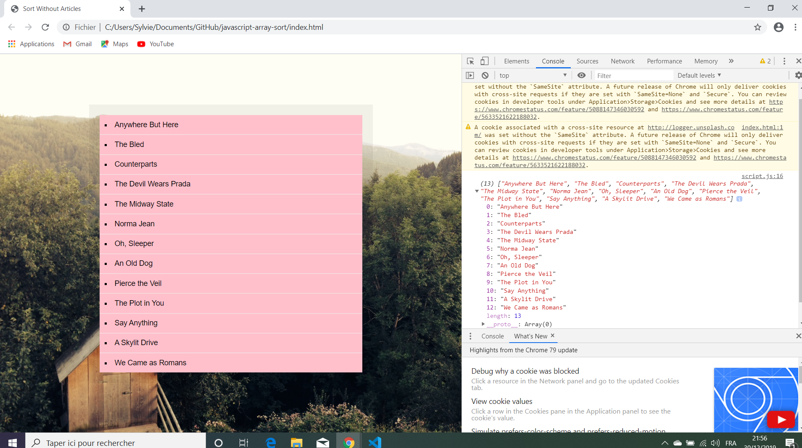

# Javascript Array Sort

Wes Bos Youtube Tutorial: [JavaScript Practice: Sorting Band Names without articles - #JavaScript30 17/30](https://www.youtube.com/watch?v=PEEo-2mRQ7A&list=PLu8EoSxDXHP6CGK4YVJhL_VWetA865GOH&index=17).


*** Note: to open web links in a new window use: _ctrl+click on link_**

## Table of contents

* [General info](#general-info)
* [Screenshots](#screenshots)
* [Technologies](#technologies)
* [Setup](#setup)
* [Features](#features)
* [Status](#status)
* [Inspiration](#inspiration)
* [Contact](#contact)

## General info

* Tutorial Code to sort HTML elements based based on their text content.

## Screenshots

.

## Technologies

* [Javascript v1.9 ECMA-262 ECMAScript 2018](http://www.ecma-international.org/publications/standards/Ecma-262.htm)

## Setup

* Open index.html in browser. If any code is changed the browser needs to be refreshed.

## Code Examples

* Functions to remove articles & alphabetisize.

```javascript
// replace articles a, an & the with nothing, note space after articles in regex expression
function strip(bandName) {
  return bandName.replace(/^(a |the |an )/i, '').trim();
}

// sort in alphabetical order 
const sortedBands = bands.sort((a,b) => strip(a) > strip(b) ? 1 : -1); 
```

## Features

*  flex background, regex function could be added to.

## Status & To-Do List

* Status: Working.

* To-Do: try longer lists with more article combinations and change regex.

## Inspiration

* Wes Bos Youtube Tutorial: [JavaScript Practice: Sorting Band Names without articles - #JavaScript30 17/30](https://www.youtube.com/watch?v=PEEo-2mRQ7A&list=PLu8EoSxDXHP6CGK4YVJhL_VWetA865GOH&index=17).

## Contact

Repo created by [ABateman](https://www.andrewbateman.org) - feel free to contact me!
